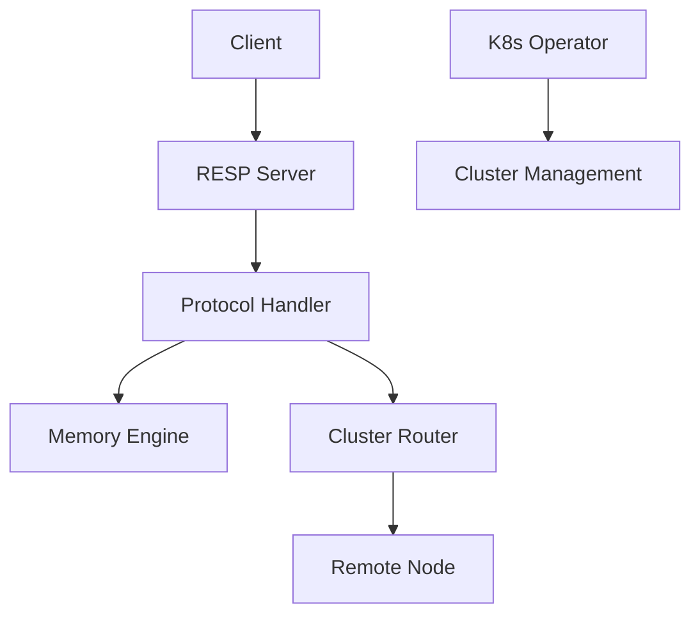
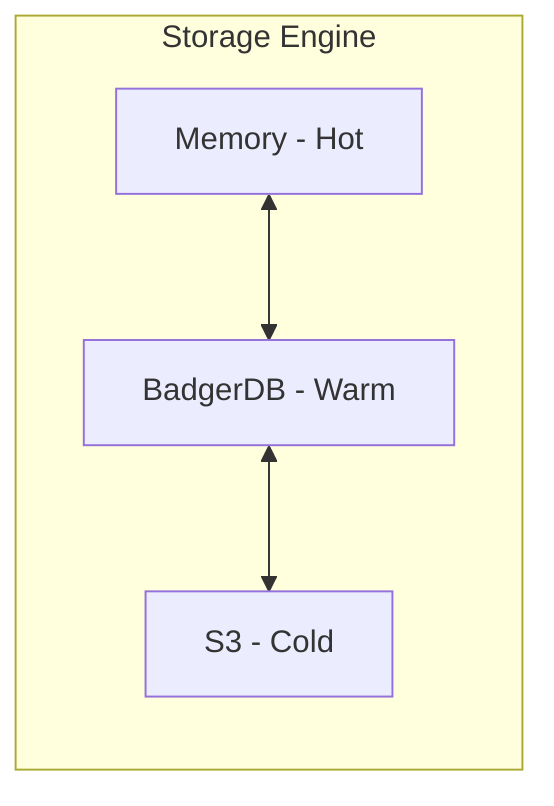
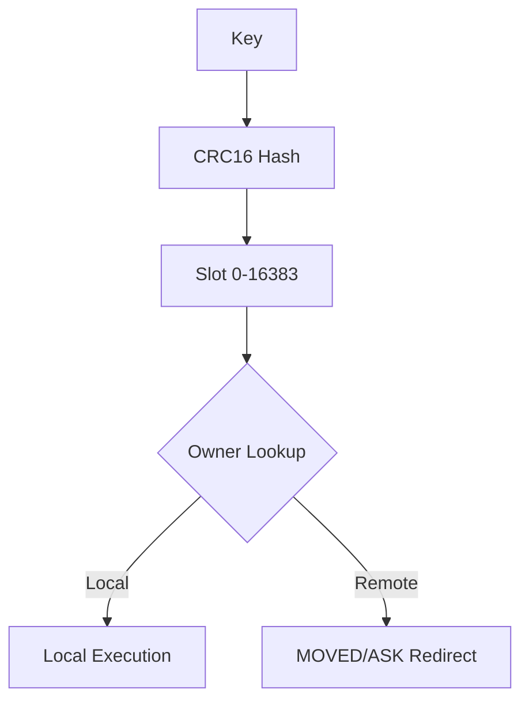
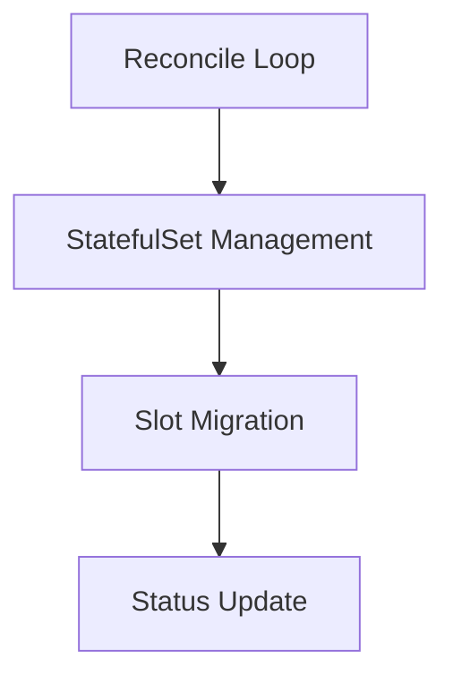

# AutoCache

[](https://golang.org/)
[](LICENSE)
[](#development)

> Redis-compatible distributed cache system in Go, featuring tiered storage and Kubernetes-native management.

AutoCache is a high-performance, distributed key-value store designed for cloud-native environments. It implements the RESP (Redis Serialization Protocol) to ensure compatibility with existing Redis clients while providing advanced features like tiered storage and seamless Kubernetes integration.

## Features

- **RESP Protocol Compatible**: Works with standard Redis clients (`redis-cli`, `go-redis`, etc.).
- **16384-Slot Sharding**: Redis Cluster compatible sharding for horizontal scalability.
- **Tiered Storage**: Intelligent data placement across Memory (Hot), SSD (Warm), and S3 (Cold).
- **Kubernetes Operator**: Native CRD-based management for automated deployment and scaling.
- **Prometheus Metrics**: Built-in observability for monitoring cache performance and health.
- **Cluster Routing**: Support for `MOVED` and `ASK` redirects with `ASKING` flag support.

## Quick Start

### Local Development

Build and run the AutoCache server locally:

```bash
# Build
go build -o autocache ./cmd/server

# Run
./autocache

# Or run directly
go run ./cmd/server
```

Test the connection using `redis-cli` or the built-in CLI:

```bash
# Test with redis-cli
redis-cli -p 6379 PING

# Or use built-in CLI
./autocache -cli PING
```

### Kubernetes

Deploy AutoCache to your Kubernetes cluster using Helm:

```bash
# Add Helm repository (example)
helm repo add autocache https://charts.autocache.io
helm repo update

# Install AutoCache Operator
helm install autocache-operator autocache/autocache-operator

# Deploy an AutoCache cluster
kubectl apply -f deploy/k8s/cluster.yaml
```

## Architecture

### System Overview
The system consists of a RESP server handling client requests, a protocol handler for command parsing, and a pluggable storage engine.



### Tiered Storage
AutoCache supports tiered storage to balance performance and cost. 
*Note: Engine modules are available; default server configuration uses memory only.*



### Cluster Routing
AutoCache uses a 16384-slot sharding mechanism. Requests are routed based on the key's slot ownership.



### K8s Operator
The operator manages the lifecycle of AutoCache clusters, including scaling and slot migration.



## Configuration

The server can be configured using the following flags:

| Flag | Default | Description |
|------|---------|-------------|
| `-addr` | `:6379` | Server listening address |
| `-cluster-enabled` | `false` | Enable cluster mode |
| `-cluster-port` | `16379` | Cluster communication port |
| `-bind` | `127.0.0.1` | Bind address for cluster communication |
| `-seeds` | `""` | Comma-separated seed nodes (host:port) |
| `-node-id` | `""` | Unique node ID (auto-generated if empty) |
| `-data-dir` | `./data` | Directory for persistent state |
| `-cli` | `false` | Run in CLI mode |
| `-h` | `127.0.0.1` | Server host (CLI mode) |
| `-p` | `6379` | Server port (CLI mode) |

## Benchmarks

AutoCache is optimized for high-throughput workloads.

- **Native Performance**: ~1.5x faster than Redis in local benchmarks (74K vs 49K ops/sec).
- **Kubernetes Performance**: ~45% of Redis performance due to container networking overhead.

*Note: Benchmarks vary based on hardware and network configuration.*

**Reproduce Benchmarks:**
```bash
redis-benchmark -p 6379 -n 100000 -c 50 -t set,get -q
```

## Development

Ensure you have Go 1.24.0+ installed.

```bash
# Build all components
go build ./cmd/server
go build ./cmd/operator

# Run tests with race detection
go test -v -race ./...

# Linting
golangci-lint run ./...

# Formatting
gofmt -w .
goimports -w .
```

## License

This project is licensed under the MIT License - see the [LICENSE](LICENSE) file for details.
