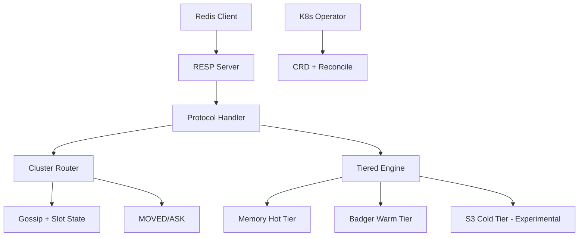

# AutoCache

[](https://golang.org/)
[](LICENSE)
[](#development)

English | [中文](README_CN.md)

> Redis-compatible distributed cache system in Go, with tiered storage and Kubernetes-native control-plane support.

AutoCache is a Redis-protocol-compatible distributed cache project focused on cloud-native deployment, cluster coordination, and tiered data placement. The repository includes two primary executables: the RESP server (`cmd/server`) and the Kubernetes operator (`cmd/operator`).

## Features

- **RESP-compatible access**: Works with standard Redis clients (`redis-cli`, `go-redis`, etc.).
- **Redis Cluster-style sharding**: 16384-slot routing with `MOVED`/`ASK` redirects and `ASKING` support.
- **Tiered storage path**: Validated `Memory (Hot) + BadgerDB (Warm)` path, with S3 cold tier marked experimental.
- **Cluster coordination**: Gossip-based membership/status propagation with failover, replication, and slot migration modules.
- **Kubernetes-native management**: CRD + controller-based operator for cluster lifecycle orchestration.
- **Built-in observability**: Prometheus metrics endpoint for runtime visibility.

## Quick Start

### Local server

```bash
# Build server binary
make build

# Run server
./bin/autocache

# Or run directly
make run
```

Sanity check with `redis-cli`:

```bash
redis-cli -p 6379 PING
```

CLI mode via the same server binary:

```bash
./bin/autocache -cli -h 127.0.0.1 -p 6379 PING
```

### Tiered mode (Memory + Badger)

```bash
go run ./cmd/server \
  -tiered-enabled \
  -data-dir ./data \
  -badger-path ./data/warm
```

### Clipboard demo app

```bash
# Terminal 1
go run ./cmd/server -addr 127.0.0.1:6379 -metrics-addr 127.0.0.1:9121

# Terminal 2
make build-clipboard
./bin/clipboard -addr 127.0.0.1:8080 -backend-addr 127.0.0.1:6379 -metrics-addr 127.0.0.1:9122 -admin-token test-token
```

Or run directly:

```bash
make run-clipboard
```

### Operator workflow (local cluster)

```bash
# Build operator
make build-operator

# Run operator locally (against your kubeconfig)
go run ./cmd/operator

# Generate/update CRDs and manifests
make generate
make manifests

# Install CRD and deploy controller
make install-crd
make deploy
```

## Benchmarking

Reproducible benchmark scripts are under `scripts/`:

- `scripts/bench-native.sh` - native localhost AutoCache vs Redis comparison
- `scripts/bench-cluster.sh` - 3-node cluster benchmark with final summary table
- `scripts/bench-vs-redis.sh` / `scripts/bench-vs-redis-full.sh` - broader command mix comparison
- `scripts/bench-tiered.sh` / `scripts/bench-cloud-native.sh` - tiered/cloud-native scenarios

Example:

```bash
bash scripts/bench-native.sh 50000 30 100
bash scripts/bench-cluster.sh 60000 30
```

Notes:

- Results depend heavily on hardware, network, and container runtime.
- Use benchmark numbers as scenario-specific measurements, not absolute conclusions.
- Current primary validated storage path is Hot+Warm; Cold (S3) is experimental.

## Architecture

### System overview


```mermaid
graph TD
    Client[Redis Client] --> RESP[RESP Server]
    RESP --> Handler[Protocol Handler]
    Handler --> Router[Cluster Router]
    Handler --> Engine[Tiered Engine]
    Router --> Gossip[Gossip + Slot State]
    Router --> Redirect[MOVED/ASK]
    Engine --> Hot[Memory Hot Tier]
    Engine --> Warm[Badger Warm Tier]
    Engine --> Cold[S3 Cold Tier - Experimental]
    Operator[K8s Operator] --> Cluster[CRD + Reconcile]
```

### Tiered storage

```mermaid
graph LR
    Hot[Memory - Hot] <--> Warm[BadgerDB - Warm]
    Warm <--> Cold[S3 - Cold (Experimental)]
```

## Configuration

Server flags (`cmd/server`):

| Flag | Default | Description |
|------|---------|-------------|
| `-addr` | `:6379` | Server listen address |
| `-cluster-enabled` | `false` | Enable cluster mode |
| `-cluster-port` | `16379` | Cluster communication port |
| `-node-id` | `""` | Node ID (auto-generated if empty) |
| `-bind` | `127.0.0.1` | Bind address for cluster communication |
| `-seeds` | `""` | Comma-separated seed nodes (`host:port`) |
| `-data-dir` | `./data` | Data directory |
| `-config` | `""` | Optional config file path |
| `-quiet-connections` | `false` | Reduce per-connection logs |
| `-tiered-enabled` | `false` | Enable tiered storage |
| `-badger-path` | `""` | Warm-tier Badger path (default `<data-dir>/warm`) |
| `-metrics-addr` | `:9121` | Prometheus metrics address |
| `-v` / `-version` | `false` | Print version and exit |
| `-cli` | `false` | Run CLI mode |
| `-h` | `127.0.0.1` | Server host for CLI mode |
| `-p` | `6379` | Server port for CLI mode |

## Development

Prerequisites:

- Go 1.24+
- `golangci-lint` (for `make lint`)
- `goimports` (for `make fmt`)
- `controller-gen` (for `make generate` / `make manifests`)

Common commands:

```bash
# Build
make build
make build-operator
make build-clipboard

# Test
make test
make test-unit
make test-integration

# Quality
make lint
make fmt
make vet
```

## Project Layout

- `cmd/server` - RESP server entrypoint
- `cmd/operator` - Kubernetes operator entrypoint
- `internal/protocol` - command handling and routing
- `internal/engine` - memory/tiered storage engine
- `internal/cluster` - gossip, failover, replication, migration
- `controllers` + `api/v1alpha1` - CRD and reconcile logic
- `scripts` - benchmark and cluster workflow scripts

## License

This project is licensed under the MIT License - see [LICENSE](LICENSE).
