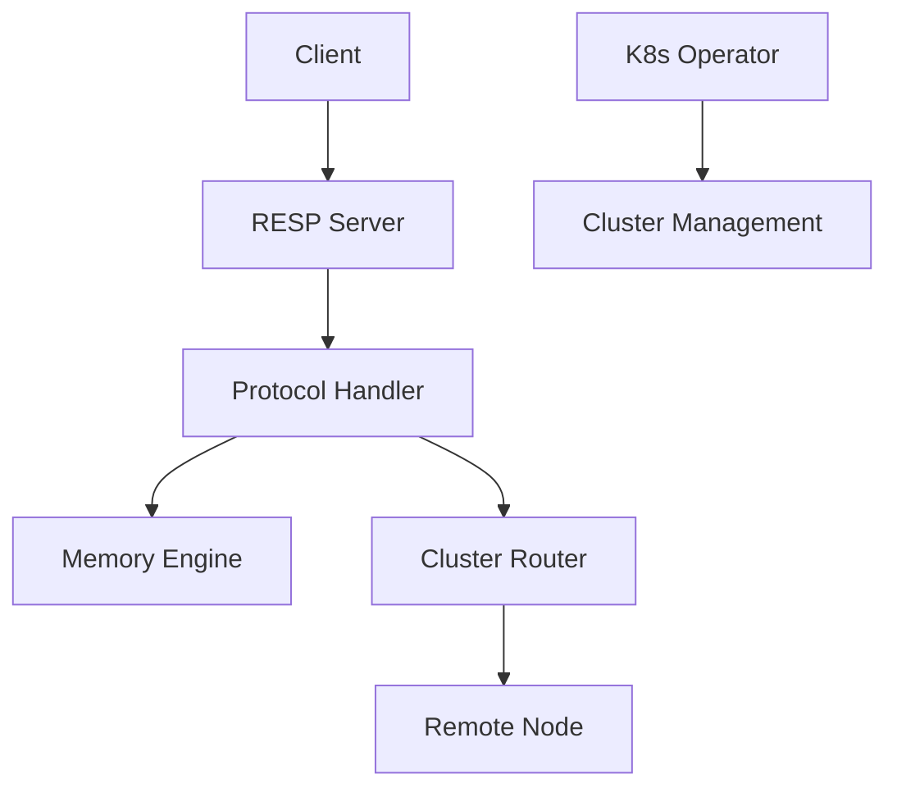
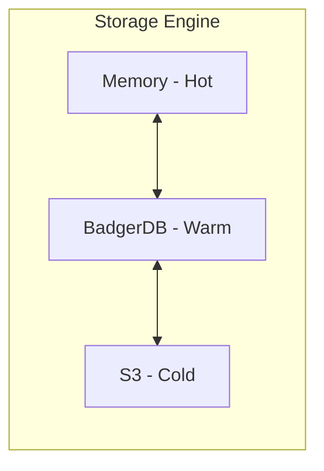
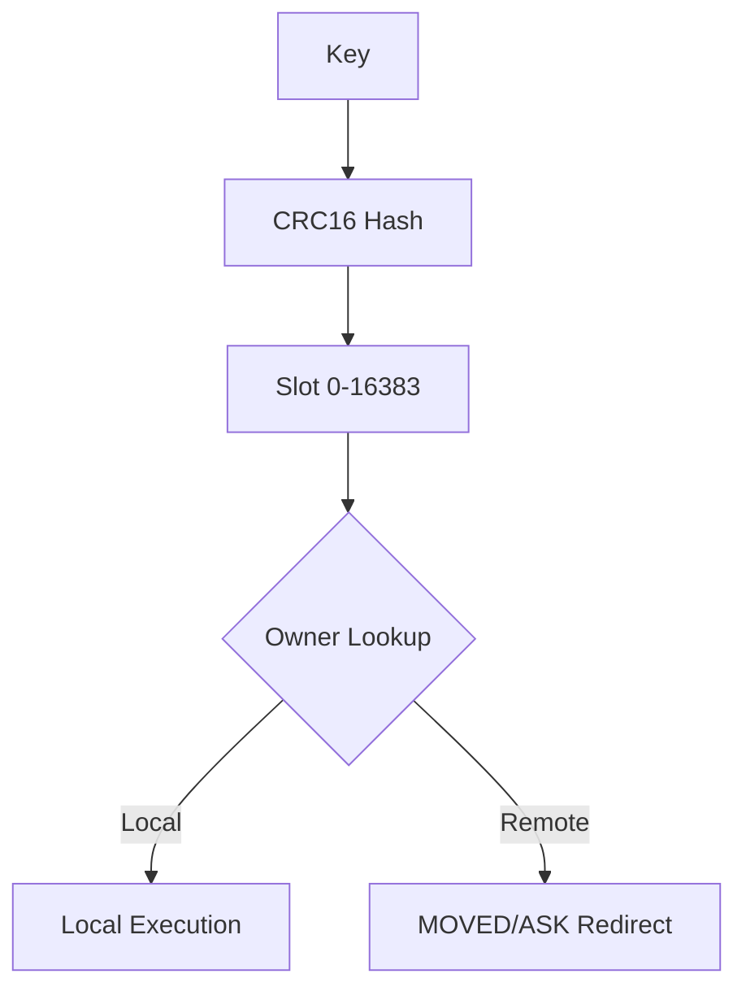
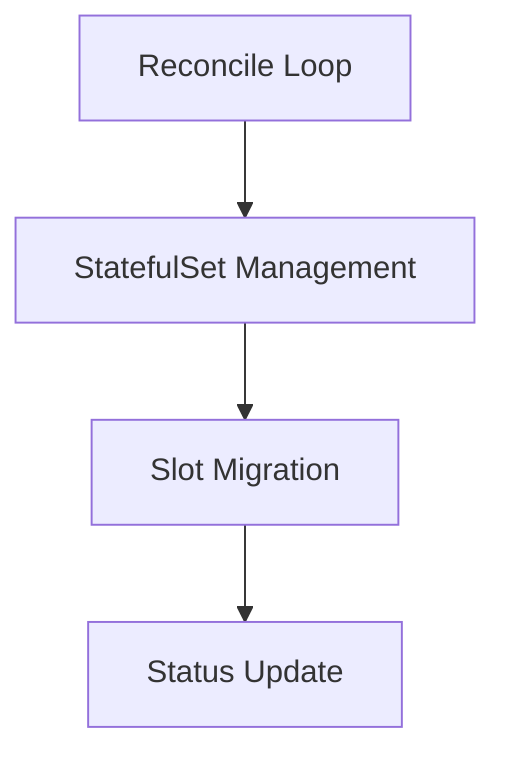

# AutoCache

[](https://golang.org/)
[](LICENSE)
[](#开发指南)

[English](README.md) | 中文

> 基于 Go 语言的 Redis 兼容分布式缓存系统，支持分层存储和 Kubernetes 原生管理。

AutoCache 是一款高性能分布式键值存储系统，专为云原生环境设计。它实现了 RESP（Redis 序列化协议），确保与现有 Redis 客户端兼容，同时提供分层存储和无缝 Kubernetes 集成等高级功能。

## 功能特性

- **RESP 协议兼容**：支持标准 Redis 客户端（`redis-cli`、`go-redis` 等）。
- **16384 槽位分片**：与 Redis Cluster 兼容的分片方案，支持水平扩展。
- **分层存储**：智能数据分层，覆盖内存（热数据）、SSD（温数据）和 S3（冷数据）。
- **Kubernetes Operator**：基于 CRD 的原生管理，实现自动化部署和扩缩容。
- **Prometheus 指标**：内置可观测性，监控缓存性能和健康状态。
- **集群路由**：支持 `MOVED` 和 `ASK` 重定向及 `ASKING` 标志。

## 快速开始

### 本地开发

构建并运行 AutoCache 服务：

```bash
# 构建
go build -o autocache ./cmd/server

# 运行
./autocache

# 或直接运行
go run ./cmd/server
```

使用 `redis-cli` 或内置 CLI 测试连接：

```bash
# 使用 redis-cli 测试
redis-cli -p 6379 PING

# 或使用内置 CLI
./autocache -cli PING
```

### Kubernetes 部署

使用 Helm 将 AutoCache 部署到 Kubernetes 集群：

```bash
# 添加 Helm 仓库（示例）
helm repo add autocache https://charts.autocache.io
helm repo update

# 安装 AutoCache Operator
helm install autocache-operator autocache/autocache-operator

# 部署 AutoCache 集群
kubectl apply -f deploy/k8s/cluster.yaml
```

## 架构设计

### 系统概览

系统由 RESP 服务器处理客户端请求、协议处理器解析命令、以及可插拔的存储引擎组成。



### 分层存储

AutoCache 支持分层存储以平衡性能和成本。
*注意：存储引擎模块已实现，但默认服务器配置仅使用内存存储。*



### 集群路由

AutoCache 使用 16384 槽位分片机制。请求根据键的槽位归属进行路由。



### K8s Operator

Operator 管理 AutoCache 集群的生命周期，包括扩缩容和槽位迁移。



## 配置选项

服务器支持以下启动参数：

| 参数 | 默认值 | 说明 |
|------|--------|------|
| `-addr` | `:6379` | 服务监听地址 |
| `-cluster-enabled` | `false` | 启用集群模式 |
| `-cluster-port` | `16379` | 集群通信端口 |
| `-bind` | `127.0.0.1` | 集群通信绑定地址 |
| `-seeds` | `""` | 种子节点列表（逗号分隔，格式 host:port） |
| `-node-id` | `""` | 节点唯一标识（留空则自动生成） |
| `-data-dir` | `./data` | 持久化状态存储目录 |
| `-cli` | `false` | 以 CLI 模式运行 |
| `-h` | `127.0.0.1` | 服务器地址（CLI 模式） |
| `-p` | `6379` | 服务器端口（CLI 模式） |

## 性能基准

AutoCache 针对高吞吐量场景进行了优化。

- **原生性能**：本地基准测试中比 Redis 快约 1.5 倍（74K vs 49K ops/sec）。
- **Kubernetes 性能**：由于容器网络开销，约为 Redis 性能的 45%。

*注意：基准测试结果因硬件和网络配置而异。*

**复现基准测试：**
```bash
redis-benchmark -p 6379 -n 100000 -c 50 -t set,get -q
```

## 开发指南

确保已安装 Go 1.24.0 或更高版本。

```bash
# 构建所有组件
go build ./cmd/server
go build ./cmd/operator

# 运行测试（启用竞态检测）
go test -v -race ./...

# 代码检查
golangci-lint run ./...

# 代码格式化
gofmt -w .
goimports -w .
```

## 许可证

本项目采用 MIT 许可证 - 详情请参阅 [LICENSE](LICENSE) 文件。
