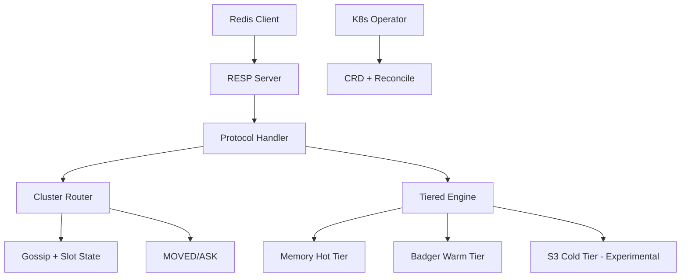

# AutoCache

[](https://golang.org/)
[](LICENSE)
[](#开发指南)

[English](README.md) | 中文

> 基于 Go 的 Redis 兼容分布式缓存系统，支持分层存储与 Kubernetes 原生控制面。

AutoCache 是一个 Redis 协议兼容的分布式缓存项目，重点关注云原生部署、集群协同和分层数据放置。仓库包含两个主要可执行入口：RESP 服务端（`cmd/server`）和 Kubernetes Operator（`cmd/operator`）。

## 功能特性

- **RESP 兼容访问**：支持标准 Redis 客户端（`redis-cli`、`go-redis` 等）。
- **Redis Cluster 风格分片**：基于 16384 槽位路由，支持 `MOVED`/`ASK` 重定向与 `ASKING`。
- **分层存储路径**：已验证 `Memory(Hot) + BadgerDB(Warm)` 路径，S3 冷层目前为实验特性。
- **集群协同能力**：具备基于 Gossip 的成员/状态传播，以及故障转移、复制、槽位迁移相关模块。
- **Kubernetes 原生管理**：基于 CRD + Controller 的集群生命周期编排。
- **内置可观测性**：提供 Prometheus 指标暴露。

## 快速开始

### 本地服务

```bash
# 构建服务端二进制
make build

# 启动服务
./bin/autocache

# 或直接运行
make run
```

使用 `redis-cli` 做连通性验证：

```bash
redis-cli -p 6379 PING
```

同一二进制的 CLI 模式：

```bash
./bin/autocache -cli -h 127.0.0.1 -p 6379 PING
```

### 分层模式（Memory + Badger）

```bash
go run ./cmd/server \
  -tiered-enabled \
  -data-dir ./data \
  -badger-path ./data/warm
```

### Clipboard 示例应用

```bash
# 终端 1
go run ./cmd/server -addr 127.0.0.1:6379 -metrics-addr 127.0.0.1:9121

# 终端 2
make build-clipboard
./bin/clipboard -addr 127.0.0.1:8080 -backend-addr 127.0.0.1:6379 -metrics-addr 127.0.0.1:9122 -admin-token test-token
```

或直接运行：

```bash
make run-clipboard
```

### Operator 工作流（本地集群）

```bash
# 构建 Operator
make build-operator

# 本地运行 Operator（使用当前 kubeconfig）
go run ./cmd/operator

# 生成/更新 CRD 与 manifests
make generate
make manifests

# 安装 CRD 并部署控制器
make install-crd
make deploy
```

## 基准测试

可复现脚本位于 `scripts/`：

- `scripts/bench-native.sh`：本机 AutoCache vs Redis 对比
- `scripts/bench-cluster.sh`：3 节点集群测试（含最终汇总表）
- `scripts/bench-vs-redis.sh` / `scripts/bench-vs-redis-full.sh`：更广命令集对比
- `scripts/bench-tiered.sh` / `scripts/bench-cloud-native.sh`：分层与云原生场景测试

示例：

```bash
bash scripts/bench-native.sh 50000 30 100
bash scripts/bench-cluster.sh 60000 30
```

说明：

- 结果与硬件、网络、容器运行时环境强相关。
- 基准结果应作为场景数据，不应作为绝对结论。
- 当前主要验证路径为 Hot+Warm，Cold（S3）仍为实验特性。

## 架构设计

### 系统概览


```mermaid
graph TD
    Client[Redis Client] --> RESP[RESP Server]
    RESP --> Handler[Protocol Handler]
    Handler --> Router[Cluster Router]
    Handler --> Engine[Tiered Engine]
    Router --> Gossip[Gossip + Slot State]
    Router --> Redirect[MOVED/ASK]
    Engine --> Hot[Memory Hot Tier]
    Engine --> Warm[Badger Warm Tier]
    Engine --> Cold[S3 Cold Tier - Experimental]
    Operator[K8s Operator] --> Cluster[CRD + Reconcile]
```

### 分层存储

```mermaid
graph LR
    Hot[Memory - Hot] <--> Warm[BadgerDB - Warm]
    Warm <--> Cold[S3 - Cold (Experimental)]
```

## 配置选项

服务端参数（`cmd/server`）：

| 参数 | 默认值 | 说明 |
|------|--------|------|
| `-addr` | `:6379` | 服务监听地址 |
| `-cluster-enabled` | `false` | 启用集群模式 |
| `-cluster-port` | `16379` | 集群通信端口 |
| `-node-id` | `""` | 节点 ID（为空自动生成） |
| `-bind` | `127.0.0.1` | 集群通信绑定地址 |
| `-seeds` | `""` | 种子节点列表（逗号分隔，`host:port`） |
| `-data-dir` | `./data` | 数据目录 |
| `-config` | `""` | 可选配置文件路径 |
| `-quiet-connections` | `false` | 降低逐连接日志输出 |
| `-tiered-enabled` | `false` | 启用分层存储 |
| `-badger-path` | `""` | 温层 Badger 路径（默认 `<data-dir>/warm`） |
| `-metrics-addr` | `:9121` | Prometheus 指标地址 |
| `-v` / `-version` | `false` | 打印版本并退出 |
| `-cli` | `false` | 启用 CLI 模式 |
| `-h` | `127.0.0.1` | CLI 模式服务地址 |
| `-p` | `6379` | CLI 模式服务端口 |

## 开发指南

前置依赖：

- Go 1.24+
- `golangci-lint`（用于 `make lint`）
- `goimports`（用于 `make fmt`）
- `controller-gen`（用于 `make generate` / `make manifests`）

常用命令：

```bash
# 构建
make build
make build-operator
make build-clipboard

# 测试
make test
make test-unit
make test-integration

# 质量检查
make lint
make fmt
make vet
```

## 项目结构

- `cmd/server`：RESP 服务端入口
- `cmd/operator`：Kubernetes Operator 入口
- `internal/protocol`：命令处理与路由
- `internal/engine`：内存/分层存储引擎
- `internal/cluster`：gossip、failover、replication、migration
- `controllers` + `api/v1alpha1`：CRD 与控制器调谐逻辑
- `scripts`：benchmark 与集群辅助脚本

## 许可证

本项目采用 MIT 许可证，详见 [LICENSE](LICENSE)。
